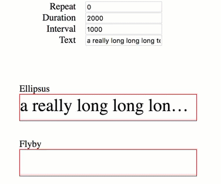

# A Text Ellipsis Component for React

[](https://travis-ci.org/noru/ellipsus)
[](https://www.npmjs.com/package/ellipsus)



Actively maintained. Welcome to PR/Issue.  🤡👉 [Demo](https://noru.github.io/ellipsus/storybook-static/index.html) 👈🤡


## Instal

```
npm install ellipsus
```

## Usage

```html

import Ellipsus from 'ellipsus'

// in your render() or whatever
<Ellipsus>
  a really long long long text.........
</Ellipsus>

// or with props
<Ellipsus repeat={repeat} duration={duration} interval={interval}>
  a really long long long text.........
</Ellipsus>

```

## Props

Name | Type |Default| Description
--------- | ---- | ------|-----------
repeat | `number`| Infinity | How many times you want your string move back and forth
duration | `number` | 2000 | Duration of animation, milliseconds
interval | `number` | 3000 | Interval between each animation, milliseconds
